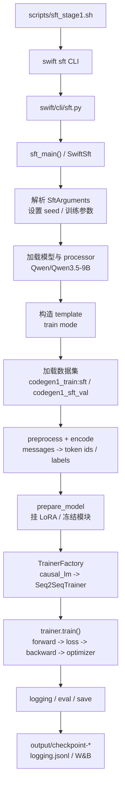
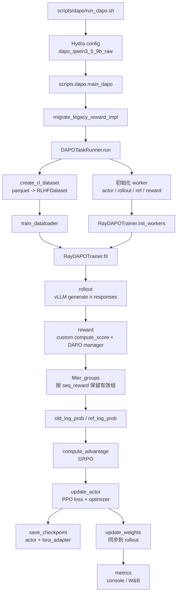
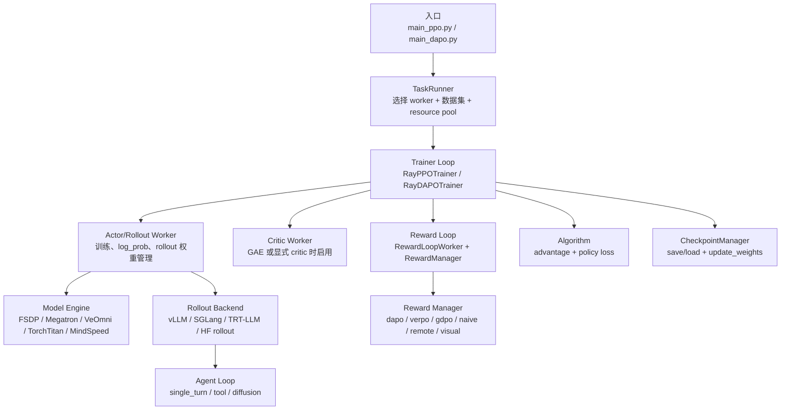
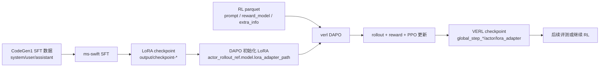

# 框架训练流程总结

本文从两个本地入口脚本出发，总结当前仓库里两条训练链路：

- `scripts/sft_stage1.sh`：调用 `ms-swift`，做第一阶段 `SFT`。
- `scripts/dapo/run_dapo.sh`：调用 `verl`，做 `DAPO/GRPO` 风格的强化学习训练。

两条链路的定位不同：`ms-swift` 侧是监督微调，核心是“加载样本 -> tokenization/模板化 -> teacher-forcing 更新 LoRA”；`verl` 侧是强化学习，核心是“加载 prompt -> rollout 生成 -> reward -> advantage -> PPO 更新 -> 同步 rollout 权重”。

---

## 1. 总体对照

| 项目 | `ms-swift` SFT | `verl` DAPO |
| --- | --- | --- |
| 入口脚本 | `scripts/sft_stage1.sh` | `scripts/dapo/run_dapo.sh` |
| 主入口 | `swift sft` -> `swift.pipelines.sft_main()` | `python3 -m scripts.dapo.main_dapo` |
| 主要配置来源 | CLI 参数 | Hydra YAML + CLI override |
| 数据形态 | Hugging Face dataset 名称与 subset | parquet 文件 |
| 训练信号 | 监督标签上的 LM loss | rollout response 的 reward/advantage |
| 模型更新 | `Seq2SeqTrainer.train()` | `RayDAPOTrainer.fit()` -> actor worker |
| rollout | 无，训练时使用已有 assistant 标签 | 有，vLLM 生成多条 response |
| 保存 | `output/checkpoint-*`，LoRA 由 `ms-swift/PEFT` 保存 | `outputs/verl/.../global_step_*/actor`，另存 PEFT `lora_adapter` |
| metric | `loss`、`eval_loss`、`acc`、`grad_norm`、`learning_rate` 等 | reward、advantage、长度、timing、throughput、actor loss、W&B histogram 等 |

---

## 2. `ms-swift` SFT 流程

### 2.1 入口命令

`scripts/sft_stage1.sh` 最终调用：

```bash
swift sft \
    --model Qwen/Qwen3.5-9B \
    --tuner_type lora \
    --external_plugins scripts/data_preprocess.py \
    --dataset codegen1_train:sft \
    --val_dataset codegen1_sft_val \
    --torch_dtype bfloat16 \
    --num_train_epochs 3 \
    --per_device_train_batch_size 2 \
    --gradient_accumulation_steps 16 \
    --eval_steps 10 \
    --save_steps 10 \
    --metric_for_best_model eval_loss \
    --output_dir output \
    --deepspeed "zero2" \
    --report_to wandb
```

这表示当前 SFT 是 LoRA 微调，使用 `bf16`、DeepSpeed ZeRO-2、W&B 日志，并且每 10 step 做评估与保存。

### 2.2 代码路径

核心调用链如下：

```text
scripts/sft_stage1.sh
  -> swift sft
  -> ms-swift/swift/cli/sft.py
  -> swift.pipelines.sft_main()
  -> ms-swift/swift/pipelines/train/sft.py:SwiftSft
  -> SwiftSft.run()
  -> TrainerFactory.get_trainer_cls(args)
  -> swift.trainers.Seq2SeqTrainer
  -> trainer.train()
```

入口文件很薄，主要负责初始化环境后进入 pipeline：

```python
# ms-swift/swift/cli/sft.py
from swift.pipelines import sft_main
sft_main()
```

`SwiftSft` 在初始化时完成模型、tokenizer/processor、template 等准备：

```python
# ms-swift/swift/pipelines/train/sft.py
self._prepare_model_tokenizer()
self._prepare_template()
```

### 2.3 Mermaid 流程图



### 2.4 数据加载与预处理

`--external_plugins scripts/data_preprocess.py` 会注册本项目的数据集名称：

```python
register_dataset(
    DatasetMeta(
        hf_dataset_id='BigfufuOuO/codegen1_merged_clean',
        dataset_name='codegen1_train',
        preprocess_func=CodeGen1SFTPreprocessor(),
        subsets=[SubsetDataset('sft', subset='sft', split=['train']), ...],
    )
)
```

预处理器把原始行里的 `system`、`user`、`assistant` 组装成标准 messages：

```python
row['messages'] = [
    {'role': 'system', 'content': system},
    {'role': 'user', 'content': user},
    {'role': 'assistant', 'content': assistant},
]
```

随后 `SwiftSft._prepare_dataset()` 会：

1. 调用 `load_dataset()` 加载训练集和验证集。
2. 调用 `_encode_dataset()`，根据 template 增加长度信息或直接编码。
3. 调用 `_post_process_datasets()`，包装为 `LazyLLMDataset`、`PackingDataset` 或已编码数据。
4. 记录样本 token 长度统计，并打印一条样本输入，方便确认模板效果。

### 2.5 模型加载、LoRA 与训练更新

模型来自：

```bash
--model Qwen/Qwen3.5-9B
--tuner_type lora
--lora_rank 64
--lora_alpha 128
--target_modules all-linear
```

`SwiftSft.run()` 中的关键顺序是：

```python
train_dataset, val_dataset = self._prepare_dataset()
self.model = self.prepare_model(self.args, self.model, template=self.template, train_dataset=train_dataset)
trainer_cls = TrainerFactory.get_trainer_cls(args)
trainer = trainer_cls(model=self.model, args=self.args.training_args, ...)
return self.train(trainer)
```

对当前 causal LM 任务，`TrainerFactory` 会选择：

```python
'causal_lm': 'swift.trainers.Seq2SeqTrainer'
```

训练更新由 Hugging Face Trainer/DeepSpeed 驱动。`Seq2SeqTrainer.compute_loss()` 对模型输出和 labels 计算 token-level LM loss；反向传播、梯度累积、optimizer step、scheduler step 由 Trainer 主循环完成。

### 2.6 保存与恢复

保存频率来自脚本：

```bash
--save_steps 10
--save_total_limit 2
--metric_for_best_model eval_loss
```

`ms-swift` 的 `SwiftMixin._save_model()` 会根据模型类型保存：

- 普通 HF 模型：`save_pretrained(...)`
- PEFT/LoRA 模型：通过对应 tuner 或 `PeftModel.save_pretrained(...)` 保存 adapter
- 训练参数：`training_args.bin`
- 训练过程汇总：`output/logging.jsonl`

`SwiftSft._save_trainer_state()` 还会汇总：

```python
self.train_msg.update({
    'last_model_checkpoint': state.last_model_checkpoint,
    'best_model_checkpoint': state.best_model_checkpoint,
    'best_metric': state.best_metric,
    'global_step': state.global_step,
    'log_history': state.log_history,
    'memory': getattr(state, 'max_memory', None),
})
```

### 2.7 Metric 与日志

SFT 主要 metric 来源有三层：

| 来源 | 内容 |
| --- | --- |
| Trainer 默认日志 | `loss`、`grad_norm`、`learning_rate`、step、epoch |
| eval loop | `eval_loss`，并用于选择 best checkpoint |
| `SwiftMixin` 自定义 metric | causal LM token accuracy、MoE aux loss、channel loss 等 |

脚本中设置了：

```bash
--logging_steps 2
--eval_steps 10
--report_to wandb
```

因此训练过程会同时写控制台、W&B，以及最终的 `output/logging.jsonl`。

---

## 3. `verl` DAPO 流程

### 3.1 入口命令

`scripts/dapo/run_dapo.sh` 负责设置环境变量和覆盖少量 Hydra 配置：

```bash
NGPUS=2
TP=1
export TRANSFORMERS_OFFLINE=1
export HF_HUB_OFFLINE=1
export MODEL_PATH=${MODEL_PATH:-Qwen/Qwen3.5-9B}
export EXP_TIME_SUFFIX=$(date +%m-%d_%H%M)

python3 -m scripts.dapo.main_dapo \
    --config-path="${script_dir}/scripts/dapo/config" \
    --config-name=dapo_qwen3_5_9b_raw \
    trainer.n_gpus_per_node=$NGPUS \
    trainer.experiment_name=DAPO-Qwen3.5-9B-raw_${EXP_TIME_SUFFIX} \
    actor_rollout_ref.rollout.tensor_model_parallel_size=$TP
```

当前实际配置文件是：

```text
scripts/dapo/config/dapo_qwen3_5_9b_raw.yaml
```

它继承 `dapo_trainer.yaml` 和 `ppo_trainer.yaml`，再覆盖数据、模型、rollout、reward、trainer 等字段。

### 3.2 代码路径

核心调用链如下：

```text
scripts/dapo/run_dapo.sh
  -> python3 -m scripts.dapo.main_dapo
  -> migrate_legacy_reward_impl(config)
  -> run_ppo(config, task_runner_class=DAPOTaskRunner)
  -> DAPOTaskRunner.run(config)
  -> create_rl_dataset(...)
  -> RayDAPOTrainer(...)
  -> trainer.init_workers()
  -> trainer.fit()
```

`main_dapo.py` 与标准 PPO 入口的主要区别，是把 trainer 换成了本项目的 `RayDAPOTrainer`：

```python
from .dapo_ray_trainer import RayDAPOTrainer

trainer = RayDAPOTrainer(...)
trainer.init_workers()
trainer.fit()
```

### 3.3 Mermaid 流程图



### 3.4 数据加载

当前 raw DAPO 配置使用 parquet：

```yaml
data:
  train_files: /root/autodl-tmp/rl_data/mix_medium_hard/mix_medium_train.parquet
  val_files: /root/autodl-tmp/rl_data/mix_medium_hard/mix_medium_test.parquet
  prompt_key: prompt
  max_prompt_length: 4096
  max_response_length: 10240
  train_batch_size: 8
  apply_chat_template_kwargs:
    enable_thinking: true
```

`DAPOTaskRunner.run()` 中会调用：

```python
train_dataset = create_rl_dataset(config.data.train_files, config.data, tokenizer, processor, is_train=True)
val_dataset = create_rl_dataset(config.data.val_files, config.data, tokenizer, processor, is_train=False)
train_sampler = create_rl_sampler(config.data, train_dataset)
```

`create_rl_dataset()` 会实例化 `verl.utils.dataset.rl_dataset.RLHFDataset`。这个 dataset 会读取 parquet/json/jsonl，按 `prompt_key` 取 prompt，并过滤过长 prompt：

```python
dataframe = dataframe.filter(
    lambda doc: doc2len(doc) <= self.max_prompt_length,
    desc=f"Filtering prompts longer than {self.max_prompt_length} tokens",
)
```

训练时 `__getitem__()` 返回 raw prompt、dummy tensor、index、tools/interaction kwargs 等字段；实际 rollout 的 chat template 处理在 agent/rollout 侧完成。

### 3.5 Rollout 生成

当前配置使用 vLLM rollout：

```yaml
actor_rollout_ref:
  rollout:
    name: vllm
    n: 8
    temperature: 1.0
    top_p: 0.95
    max_model_len: 16384
    max_num_seqs: 16
    tensor_model_parallel_size: 1
```

`RayDAPOTrainer.fit()` 对每个 prompt batch 做：

```python
gen_batch = self._get_gen_batch(new_batch)
gen_batch_output = gen_batch.repeat(
    repeat_times=self.config.actor_rollout_ref.rollout.n,
    interleave=True,
)
gen_batch_output = self.async_rollout_manager.generate_sequences(gen_batch_output)
```

也就是说，一个 prompt 会生成 `n=8` 条 response，用于组内比较。生成结果会与原始 prompt batch 合并成新的 `DataProto`，后续 reward、filter 和 advantage 都在这个 batch 上做。

### 3.6 Reward 与组过滤

当前 reward 配置：

```yaml
reward:
  reward_manager:
    name: dapo
  reward_kwargs:
    overlong_buffer_cfg:
      enable: true
      len: 2048
      penalty_factor: 0.2
    max_resp_len: ${data.max_response_length}
  custom_reward_function:
    path: scripts/plugins/verl_codegen1_raw_reward.py
    name: compute_score
    reward_kwargs:
      timeout_sec: 4
      memory_limit_mb: 1024
```

`migrate_legacy_reward_impl(config)` 后，当前路径使用 experimental reward loop 中注册的 `dapo` manager。该 manager 会 decode response，然后调用自定义 `compute_score()`。

`scripts/plugins/verl_codegen1_raw_reward.py` 的核心语义是：

```python
passed = sum(1 for item in results if item.get("passed", False))
total = len(results)
all_passed = passed == total
score = 1.0 if all_passed else -1.0
```

返回的 dict 中包含：

```python
{
    "score": score,
    "acc": score,
    "passed": passed,
    "total": total,
    "pass_rate": pass_rate,
    "all_passed": all_passed,
}
```

`DAPORewardManager` 会把 `score` 放入 reward，并把其余字段放入 `reward_extra_info`。如果 response 超过 overlong buffer，且原始 `score > 0`，再额外扣 overlong penalty。

当前组过滤配置：

```yaml
algorithm:
  adv_estimator: grpo
  filter_groups:
    enable: true
    max_num_gen_batches: 20
    metric: seq_reward
```

训练循环中会按同一个 prompt 的 `uid` 聚合 `seq_reward`。如果一组内 reward 标准差为 0，说明 8 条 response 没有形成有效偏好差异，该 prompt 组会被过滤；如果过滤后 prompt 数不足 `train_batch_size=8`，trainer 会继续生成，最多生成 `max_num_gen_batches=20` 轮。

### 3.7 Advantage 与模型更新

当前算法设置：

```yaml
algorithm:
  adv_estimator: grpo
  norm_adv_by_std_in_grpo: true
  use_kl_in_reward: false
```

因为 `use_kl_in_reward=false`，KL 不直接加进 reward；trainer 会在组过滤后重新计算 old log prob 和 ref log prob：

```python
batch = self.compute_kl_related_metrics(batch, metrics, timing_raw)
```

然后在 driver 进程上计算 advantage：

```python
batch = compute_advantage(
    batch,
    adv_estimator=self.config.algorithm.adv_estimator,
    num_repeat=self.config.actor_rollout_ref.rollout.n,
    norm_adv_by_std_in_grpo=norm_adv_by_std_in_grpo,
)
```

actor 更新由 `RayPPOTrainer._update_actor()` 分发给 actor worker：

```python
actor_output = self.actor_rollout_wg.update_actor(batch_td)
actor_output = rename_dict(actor_output, "actor/")
```

在 FSDP worker 中，实际训练调用是：

```python
metrics = self.actor.update_policy(data=data)
self.actor_lr_scheduler.step()
```

因此 DAPO 的模型更新链路是：

```text
rollout batch -> reward -> filter -> old/ref log prob -> GRPO advantage
  -> PPO actor loss -> backward/optimizer step -> lr scheduler step
```

### 3.8 保存、恢复与 rollout 权重同步

当前保存相关配置：

```yaml
trainer:
  save_freq: 10
  max_actor_ckpt_to_keep: 3
  save_dataloader_state: false
  default_local_dir: ./outputs/verl/${trainer.project_name}/${trainer.experiment_name}
```

`RayDAPOTrainer.fit()` 在 actor 更新后判断是否保存：

```python
if self.config.trainer.save_freq > 0 and (
    is_last_step or self.global_steps % self.config.trainer.save_freq == 0
):
    self._save_checkpoint()
```

`RayPPOTrainer._save_checkpoint()` 会保存到：

```text
outputs/verl/<project>/<experiment>/global_step_<step>/actor
```

本仓库的 FSDP engine 还会额外保存 PEFT 格式 LoRA：

```python
adapter_save_path = os.path.join(local_path, "lora_adapter")
peft_model.save_pretrained(
    adapter_save_path,
    safe_serialization=True,
    selected_adapters=selected_adapters,
    state_dict=lora_state_dict,
)
```

保存之后，trainer 会同步最新 actor 权重给 rollout 侧：

```python
self.checkpoint_manager.update_weights()
```

这一步很关键：actor 更新发生在训练 worker 上，而下一轮 vLLM rollout 必须使用更新后的权重。

恢复逻辑由 `_load_checkpoint()` 处理。当前 `save_dataloader_state: false`，因此不会保存/恢复 `data.pt`，可以减少 checkpoint 体积，也避免 dataloader 状态恢复带来的额外脆弱性。

### 3.9 Metric 与日志

当前配置：

```yaml
trainer:
  logger: ['console', 'wandb']
  test_freq: 10
```

`RayDAPOTrainer.fit()` 每步汇总并记录：

| 类型 | 示例 metric |
| --- | --- |
| reward/score | `critic/score/mean`、`critic/rewards/mean`、`reward_extra/pass_rate/mean` |
| advantage/return | `critic/advantages/mean`、`critic/returns/mean` |
| 长度 | `response_length/mean`、`response_length/clip_ratio`、`prompt_length/mean` |
| actor | `actor/lr`、actor update 返回的 loss/grad/clip 等指标 |
| 性能 | `timing_s/gen`、`timing_per_token_ms/update_actor`、`perf/throughput` |
| rollout | `train/num_gen_batches` |
| validation | `_validate()` 返回的验证集指标 |
| W&B histogram | `reward_extra_dist/*`、`verpo_dist/*` 等分布类指标 |

metric 汇总逻辑在训练循环尾部：

```python
metrics.update(compute_data_metrics(batch=batch, use_critic=self.use_critic))
metrics.update(compute_timing_metrics(batch=batch, timing_raw=timing_raw))
metrics.update(compute_throughout_metrics(batch=batch, timing_raw=timing_raw, n_gpus=n_gpus))
metrics["train/num_gen_batches"] = num_gen_batches
logger.log(data=metrics, step=self.global_steps)
```

如果启用 W&B，还会额外记录 histogram：

```python
metric_arrays = compute_distribution_metrics(batch=batch, algo_config=self.config.algorithm)
wandb_distribution_metrics = build_wandb_histogram_metrics(metric_arrays, wandb_module=logger.logger["wandb"])
logger.log(data=wandb_distribution_metrics, step=self.global_steps, backend=["wandb"])
```

---

## 4. `verl` 组件地图

这一节专门用来回答“`verl` 里面有哪些组件、哪些 worker、哪些 reward loop / agent loop / trainer loop”。先给结论：`verl` 的代码组织不是一层简单 trainer，而是由 driver trainer、Ray worker、rollout/agent loop、reward loop、算法函数和 checkpoint/sync 组件共同组成。

### 4.1 总体组件关系



### 4.2 Loop 职责边界

`verl` 里会同时看到很多名字里带 `loop` 的模块。它们不是同一层东西，最容易混淆的是：有些 loop 是“训练主循环”，有些 loop 是“生成交互循环”，有些 loop 是“reward 计算循环”，还有一些只是算法函数被主循环反复调用。

| loop 类型 | 输入 | 做什么 | 输出 | 当前 raw DAPO 是否使用 |
| --- | --- | --- | --- | --- |
| Trainer loop | dataloader 取出的 prompt batch、全局 config、worker handles | 控制一整个训练 step：生成、打分、过滤、算 log prob、算 advantage、更新 actor、保存、记录 metric。它是最高层调度者，本身通常不直接跑模型 forward/backward，而是通过 Ray worker 调用。 | 更新后的全局 step、metric、checkpoint、副作用是 actor 权重变化。 | 使用，具体是 `RayDAPOTrainer.fit()`。 |
| Rollout loop | prompt batch、采样参数、当前 actor 权重 | 调用 rollout backend 生成 response。普通单轮任务就是 prompt -> response；多轮/工具任务会交给 agent loop 控制多步交互。 | 带 `responses`、attention mask、timing 等字段的 `DataProto`。 | 使用，backend 是 `vllm`，每个 prompt 生成 `n=8` 条 response。 |
| Agent loop | 单条或一批 raw prompt、LLM server 地址、tool/env 配置 | 决定“怎么生成”：单轮直接问模型；tool agent 会解析工具调用、执行工具、把 observation 拼回上下文继续生成；环境类 agent 会和 env 循环交互。它更像 rollout 的行为策略。 | 完整 trajectory，包括 response、工具调用/环境信息、token 统计、可选 reward 信息。 | 当前配置只显式设置 `agent.num_workers=1`，主要走单轮生成语义；复杂 tool/env loop 没有在 raw DAPO 配置中展开。 |
| Reward loop | 已生成 response 的 batch、tokenizer、reward config | 把 token ids decode 成文本，调用 reward manager；如果 manager 支持 `run_batch`，会按 batch/group 一起算 reward，否则逐条算。它负责把 reward 计算并行化、异步化，并统一返回格式。 | `rm_scores` / `reward_score`，以及 `acc`、`pass_rate`、`passed` 等 `reward_extra_info`。 | 使用，具体是 experimental `RewardLoopWorker` + `DAPORewardManager`。 |
| Reward manager loop | 单条样本或一组样本、custom reward function、reward kwargs | 定义“奖励语义”。例如 DAPO manager decode response 后调用 `compute_score()`，再处理 overlong penalty；VeRPO manager 会利用组级统计。 | 标量 reward 和额外统计字段。 | 使用 `dapo` manager，custom function 是 `verl_codegen1_raw_reward.py:compute_score`。 |
| Algorithm loop | 带 reward/log prob/mask 的 rollout batch、算法配置 | 不是独立 Ray worker，而是在 trainer step 里反复调用的算法计算：GRPO/GAE/VeRPO advantage、policy loss、KL、clip 等。 | `advantages`、`returns`、policy loss 需要的张量。 | 使用 `grpo` advantage；policy loss 由 actor worker 的 `update_policy()` 内部使用。 |
| Model update loop | 带 advantages、old log prob、responses 的 batch | 真正做训练：actor forward，计算 PPO/GRPO policy loss，backward，gradient clip，optimizer step，lr scheduler step。 | actor 参数更新，以及 `actor/*`、`perf/*` metrics。 | 使用，入口是 trainer 的 `_update_actor()`，实际在 `ActorRolloutRefWorker.update_actor()` 和底层 engine 中执行。 |
| Checkpoint / weight-sync loop | 当前 global step、actor worker、rollout replicas | 定期保存 checkpoint；保存后把新 actor 权重同步给 rollout/vLLM，否则下一轮 rollout 还会用旧权重。 | `global_step_*/actor`、`actor/lora_adapter`，以及 rollout 侧最新权重。 | 使用，`save_freq=10`，保存后调用 `checkpoint_manager.update_weights()`。 |
| Eval / metric loop | validation dataloader、当前 actor、reward function、训练 batch | 周期性 validation；每个训练 step 汇总 reward、长度、advantage、timing、throughput、actor loss、W&B histogram。 | console/W&B 日志、`Final validation metrics`。 | 使用，`test_freq=10`，logger 是 `console + wandb`。 |
| Env loop | action、环境状态、VLA/robotics config | 在 robotics/VLA 类任务中让模型动作和环境状态循环交互。它不是普通文本 DAPO 的主路径。 | 环境 observation、reward、done、trajectory。 | 当前 raw DAPO 不使用。 |

用当前 raw DAPO 的一个训练 step 串起来看，顺序大致是：

```text
Trainer loop
  -> 从 train_dataloader 取 prompt batch
  -> Rollout / Agent loop 生成 n=8 条 response
  -> Reward loop 调用 DAPORewardManager 和 compute_score
  -> Trainer loop 按 seq_reward 做 group filtering
  -> Algorithm loop 计算 old/ref log prob 和 GRPO advantage
  -> Model update loop 更新 actor LoRA 参数
  -> Checkpoint / weight-sync loop 定期保存并同步 vLLM 权重
  -> Eval / metric loop 记录训练指标，按 test_freq 做验证
```

所以，“loop”这个词在 `verl` 里最核心的判断方式是：它是在控制整个训练 step，还是只控制生成交互，还是只控制 reward 计算。当前 DAPO 的主干是 `Trainer loop -> Rollout loop -> Reward loop -> Algorithm loop -> Model update loop`。

### 4.3 Trainer loops

| loop / trainer | 文件 | 作用 |
| --- | --- | --- |
| `RayPPOTrainer` | `verl/verl/trainer/ppo/ray_trainer.py` | 标准 PPO/RLHF 主循环，负责 rollout、reward、advantage、actor/critic update、保存和日志。 |
| `RayDAPOTrainer` | `scripts/dapo/dapo_ray_trainer.py` | 本项目 DAPO 主循环，继承 `RayPPOTrainer`，重点增加/改写了 DAPO group filtering、reward 后处理和训练循环。 |
| `SFTTrainer` | `verl/verl/trainer/sft_trainer.py`、`verl/verl/trainer/sft_trainer_ray.py` | `verl` 自带 SFT 训练器，和本文前半部分的 `ms-swift` SFT 不是同一条链路。 |
| `PPOTrainer` sync path | `verl/verl/trainer/main_ppo_sync.py` | 同步/队列式 PPO 路径，包含 `AgentLoopWorkerTQ`、`AgentLoopManagerTQ`。 |
| `SeparateRayPPOTrainer` | `verl/verl/experimental/separation/ray_trainer.py` | actor 与 rollout 分离的实验训练器。 |
| `OneStepOffRayTrainer` | `verl/verl/experimental/one_step_off_policy/ray_trainer.py` | one-step off-policy 实验路径。 |
| `FullyAsyncTrainer` | `verl/verl/experimental/fully_async_policy/fully_async_trainer.py` | fully async policy 实验路径。 |
| `RobRayPPOTrainer` / `RobRaySACTrainer` | `verl/verl/experimental/vla/rob_ray_trainer.py`、`verl/verl/experimental/vla/sac/sac_ray_trainer.py` | VLA/robotics 实验路径。 |

当前 `scripts/dapo/run_dapo.sh` 走的是：

```text
scripts.dapo.main_dapo
  -> DAPOTaskRunner
  -> RayDAPOTrainer.fit()
```

### 4.4 Worker 层

`TaskRunner` 会根据配置把不同 role 映射成 Ray worker。核心 role 来自 `verl.trainer.ppo.utils.Role`：

| role | 含义 |
| --- | --- |
| `Actor` | 只负责策略模型训练的 actor。 |
| `Rollout` | 只负责生成的 rollout。 |
| `ActorRollout` | hybrid engine 常见形式，actor 与 rollout 共用 worker/资源。 |
| `ActorRolloutRef` | actor、rollout、ref policy 融合在同一 worker。 |
| `Critic` | value/critic worker，仅 GAE 或显式启用 critic 时需要。 |
| `RefPolicy` | reference policy worker，legacy worker 路径下可能单独存在。 |
| `RewardModel` | reward model 资源池角色，当前 raw DAPO 使用自定义 rule reward，不是独立 reward model 训练 worker。 |
| `TeacherModel` | distillation 时的 teacher model。 |

主要 worker 实现：

| worker | 文件 | 说明 |
| --- | --- | --- |
| `ActorRolloutRefWorker` | `verl/verl/workers/engine_workers.py` | 新 model engine worker。`use_legacy_worker_impl: disable` 时使用，是当前 raw DAPO 的主 worker 入口。 |
| `TrainingWorker` | `verl/verl/workers/engine_workers.py` | 新 model engine 下的通用训练 worker，critic 可复用它。 |
| `AsyncActorRolloutRefWorker` | `verl/verl/workers/fsdp_workers.py` | legacy FSDP/FSDP2 worker。旧路径或 `use_legacy_worker_impl` 未禁用时可能使用。 |
| `CriticWorker` | `verl/verl/workers/fsdp_workers.py` | legacy FSDP critic worker。 |
| `AsyncActorRolloutRefWorker` / `CriticWorker` | `verl/verl/workers/megatron_workers.py` | Megatron worker 路径。 |
| `RobActorRolloutRefWorker` | `verl/verl/experimental/vla/fsdp_workers.py` | VLA/robotics 扩展 worker。 |
| `EnvWorker` | `verl/verl/experimental/vla/workers/env/env_worker.py` | VLA 环境交互 worker。 |

当前 raw DAPO 的关键选择是：

```yaml
trainer:
  use_legacy_worker_impl: disable

actor_rollout_ref:
  actor:
    strategy: fsdp2
```

因此实际 worker 入口是：

```text
verl/verl/workers/engine_workers.py:ActorRolloutRefWorker
  -> EngineRegistry
  -> verl/verl/workers/engine/fsdp/transformer_impl.py
```

也就是说，当前不要把 `verl/verl/workers/fsdp_workers.py` 里的 legacy `ActorRolloutRefWorker` 当成主要运行路径；它仍然有参考价值，但不是这个配置下的主入口。

### 4.5 Model engine 与 rollout backend

新 worker 会通过 `EngineRegistry` 选择底层模型引擎：

| backend | 注册位置 | 说明 |
| --- | --- | --- |
| `fsdp` / `fsdp2` | `verl/verl/workers/engine/fsdp/transformer_impl.py` | 当前 raw DAPO 的 actor/ref 训练后端。 |
| `megatron` | `verl/verl/workers/engine/megatron/transformer_impl.py` | Megatron 后端。 |
| `veomni` | `verl/verl/workers/engine/veomni/transformer_impl.py` | VeOmni 后端。 |
| `torchtitan` | `verl/verl/workers/engine/torchtitan/transformer_impl.py` | TorchTitan 后端。 |
| `mindspeed` / `mindspeed_llm` | `verl/verl/workers/engine/mindspeed/transformer_impl.py` | NPU/MindSpeed 后端。 |
| `automodel` | `verl/verl/workers/engine/automodel/transformer_impl.py` | AutoModel 后端。 |
| `diffusion_model` | `verl/verl/workers/engine/fsdp/diffusers_impl.py` | diffusion model 后端。 |

rollout backend 由 `actor_rollout_ref.rollout.name` 选择。当前配置是：

```yaml
actor_rollout_ref:
  rollout:
    name: vllm
```

可见 registry 在 `verl/verl/workers/rollout/replica.py`，目前注册了：

| rollout name | 说明 |
| --- | --- |
| `vllm` | vLLM rollout，当前 raw DAPO 使用。 |
| `sglang` | SGLang rollout。 |
| `trtllm` | TensorRT-LLM rollout。 |
| `vllm_omni` | Omni/multimodal vLLM rollout。 |

### 4.6 Agent loops

Agent loop 负责“怎么和 LLM server / tool / environment 交互”，它比普通 rollout 多一层行为逻辑。普通 rollout 只关心“给 prompt，拿 response”；agent loop 还会决定中间是否要调用工具、是否要读取环境 observation、是否要继续下一轮生成。核心文件：

```text
verl/verl/experimental/agent_loop/agent_loop.py
```

里面有：

| 组件 | 作用 |
| --- | --- |
| `AgentLoopBase` | agent loop 抽象基类。 |
| `AgentLoopWorker` | Ray worker，接收一批样本并运行 agent loop。 |
| `AgentLoopManager` | 管理多个 agent loop worker 和 rollout server。 |
| `AsyncLLMServerManager` | 管理异步 LLM server。 |

当前注册的 agent loop：

| name | 文件 | 作用 |
| --- | --- | --- |
| `single_turn_agent` | `verl/verl/experimental/agent_loop/single_turn_agent_loop.py` | 单轮 prompt -> response，是最接近普通生成的 agent loop。 |
| `tool_agent` | `verl/verl/experimental/agent_loop/tool_agent_loop.py` | 支持工具调用、多步交互。 |
| `diffusion_single_turn_agent` | `verl/verl/experimental/agent_loop/single_turn_agent_loop.py` | diffusion model 的单轮 agent loop。 |

三类 agent loop 的差别可以这样理解：

| agent loop | 典型行为 | 什么时候需要 |
| --- | --- | --- |
| `single_turn_agent` | 对一个 prompt 调一次 LLM server，得到一个 response，然后结束。 | 普通数学、代码、问答类 RL。当前 raw DAPO 基本就是这种语义。 |
| `tool_agent` | 模型生成 tool call，框架解析 tool call，执行工具，把 observation 加回上下文，再继续生成，直到结束条件满足。 | 需要搜索、代码执行、API 调用或多步工具交互的任务。 |
| `diffusion_single_turn_agent` | 面向 diffusion model 的单轮生成，返回结构不是普通文本 response。 | diffusion/VLA 类模型。 |

工具解析器还注册了：

| parser | 文件 |
| --- | --- |
| `hermes` | `verl/verl/experimental/agent_loop/tool_parser.py` |
| `gpt-oss` | `verl/verl/experimental/agent_loop/tool_parser.py` |
| `qwen3_coder` | `verl/verl/experimental/agent_loop/tool_parser.py` |

当前 raw DAPO 配置里只设置了：

```yaml
actor_rollout_ref:
  rollout:
    agent:
      num_workers: 1
```

它表示 Ray 侧 agent/rollout worker 并发数量。具体 agent loop 类型仍由 rollout/agent 配置默认值决定；如果排查多轮或工具调用，需要从 `actor_rollout_ref.rollout.agent` 和 `experimental/agent_loop` 继续追。

### 4.7 Reward loops 与 reward managers

reward loop 分两层：

1. `RewardLoopWorker` / `RewardLoopManager`：Ray 侧调度 reward 计算。
2. `RewardManager`：具体 reward 语义，比如 DAPO、VeRPO、remote reward。

核心文件：

```text
verl/verl/experimental/reward_loop/reward_loop.py
verl/verl/trainer/ppo/reward.py
verl/verl/experimental/reward_loop/reward_manager/
```

`RewardLoopWorker` 的逻辑是：

```text
加载 tokenizer
  -> load_reward_manager(config, tokenizer)
  -> 如果 manager 有 run_batch，则优先 batch reward
  -> 否则逐条 run_single
  -> 返回 reward_score 与 reward_extra_info
```

在训练 step 里，reward loop 接到的是已经拼好 prompt 和 response 的 `DataProto`。它不负责生成，也不负责优化模型，只负责把 response 变成训练可用的 reward 张量。对当前代码任务来说，具体过程是：

```text
responses token ids
  -> tokenizer.decode(valid_response_ids)
  -> compute_score(data_source, solution_str, ground_truth, extra_info)
  -> 执行/校验测试用例
  -> 返回 score / acc / pass_rate / passed / total
  -> 写回 rm_scores 和 reward_extra_info
```

这也是为什么 reward loop 和 reward manager 要分开：`RewardLoopWorker` 解决“怎么并行、怎么调度、怎么统一格式”，`RewardManager` 解决“这个任务的 reward 到底怎么算”。

experimental reward loop 下注册的 manager：

| name | 文件 | 说明 |
| --- | --- | --- |
| `dapo` | `verl/verl/experimental/reward_loop/reward_manager/dapo.py` | 当前 raw DAPO 使用；支持 overlong penalty。 |
| `verpo` | `verl/verl/experimental/reward_loop/reward_manager/verpo.py` | VeRPO reward manager，支持组级 reward 统计。 |
| `gdpo` | `verl/verl/experimental/reward_loop/reward_manager/gdpo.py` | GDPO reward manager。 |
| `naive` | `verl/verl/experimental/reward_loop/reward_manager/naive.py` | 简单 reward manager。 |
| `remote` | `verl/verl/experimental/reward_loop/reward_manager/remote.py` | 远端 reward 计算。 |
| `visual` | `verl/verl/experimental/reward_loop/reward_manager/visual.py` | 视觉/多模态 reward。 |
| `rate_limited` | `verl/verl/experimental/reward_loop/reward_manager/limited.py` | 带限流包装的 reward manager。 |

还有一套 legacy reward manager：

```text
verl/verl/workers/reward_manager/
```

里面注册了 `dapo`、`prime`、`batch`、`naive`。但当前 raw DAPO 在 `scripts/dapo/main_dapo.py` 里会先调用：

```python
config = migrate_legacy_reward_impl(config)
```

并且默认 `reward.reward_manager.source` 是 `register`，所以实际加载路径是 experimental reward loop：

```text
verl/verl/experimental/reward_loop/reward_manager/dapo.py
```

不是：

```text
verl/verl/workers/reward_manager/dapo.py
```

### 4.8 Algorithm loops

算法层不一定叫 `loop`，但它决定训练 loop 中 advantage 和 policy loss 怎么算。主要文件：

```text
verl/verl/trainer/ppo/core_algos.py
```

里面注册了多种 advantage estimator：

| estimator | 用途 |
| --- | --- |
| `gae` | 传统 PPO + critic/value。 |
| `grpo` | group relative policy optimization，当前 raw DAPO 使用。 |
| `grpo_vectorized` | vectorized GRPO。 |
| `verpo` | VeRPO advantage。 |
| `gdpo` | GDPO advantage。 |
| `grpo_passk` | pass@k 风格 GRPO。 |
| `rloo` / `rloo_vectorized` | leave-one-out baseline。 |
| `reinforce_plus_plus` / `reinforce_plus_plus_baseline` | REINFORCE++ 系列。 |
| `remax` | ReMax。 |
| `opo` | OPO。 |
| `gpg` | GPG。 |
| `optimal_token_baseline` / `tir_optimal_token_baseline` | token baseline 相关估计。 |

policy loss 也在同一个文件中注册，例如：

```text
vanilla, dppo_tv, dppo_kl, gspo, sapo, gpg, clip_cov, kl_cov, geo_mean, cispo, bypass_mode
```

diffusion 相关 policy loss 在：

```text
verl/verl/trainer/ppo/diffusion_algos.py
```

当前 raw DAPO 的算法选择是：

```yaml
algorithm:
  adv_estimator: grpo
  norm_adv_by_std_in_grpo: true
```

在当前 DAPO 里，`grpo` 的作用不是直接更新参数，而是把同一个 prompt 下多条 response 的 reward 变成相对 advantage。直观地说：同一个 prompt 生成 8 条答案，如果有的通过测试、有的没通过测试，GRPO 会让通过测试的 response 获得更高 advantage，没通过的 response 获得更低 advantage；actor update 再用这些 advantage 去放大好 response 的概率、压低坏 response 的概率。

因此 algorithm loop 的位置在 reward 和 actor update 之间：

```text
reward scores
  -> group by uid
  -> compute GRPO advantage
  -> attach advantages / returns to batch
  -> actor update uses these tensors in policy loss
```

### 4.9 当前 raw DAPO 实际组件清单

结合 `scripts/dapo/run_dapo.sh` 和 `scripts/dapo/config/dapo_qwen3_5_9b_raw.yaml`，当前训练实际组件可以压缩成下面这张表：

| 层级 | 当前使用 |
| --- | --- |
| driver entry | `scripts/dapo/main_dapo.py` |
| task runner | `DAPOTaskRunner` |
| trainer loop | `scripts/dapo/dapo_ray_trainer.py:RayDAPOTrainer` |
| worker implementation | `verl/verl/workers/engine_workers.py:ActorRolloutRefWorker` |
| model engine | `verl/verl/workers/engine/fsdp/transformer_impl.py`，因为 `actor.strategy: fsdp2` |
| rollout backend | `vllm` |
| rollout replicas / agent workers | `actor_rollout_ref.rollout.agent.num_workers: 1` |
| reward loop | `verl/verl/experimental/reward_loop/reward_loop.py` |
| reward manager | `verl/verl/experimental/reward_loop/reward_manager/dapo.py` |
| custom reward function | `scripts/plugins/verl_codegen1_raw_reward.py:compute_score` |
| advantage estimator | `grpo` |
| critic | 默认不启用，因为 `adv_estimator != gae` 且未显式 `critic.enable: true` |
| ref policy | 需要，因为 `actor.use_kl_loss: true`；新 engine 下通常融合在 `ActorRolloutRefWorker` 中 |
| checkpoint | `verl/verl/trainer/ppo/ray_trainer.py:_save_checkpoint` + `engine/fsdp/transformer_impl.py` 保存 PEFT `lora_adapter` |

---

## 5. 两条链路如何衔接



在当前配置里，`verl` DAPO 会从已有 LoRA adapter 初始化：

```yaml
actor_rollout_ref:
  model:
    lora_adapter_path: /root/lg/QwenTraining/outputs/verl/DAPO_AutoDL/.../actor/lora_adapter
```

因此完整实验闭环可以理解为：

1. `ms-swift` 用带 assistant 标签的数据做 SFT，得到初始 LoRA 能力。
2. `verl` 读取 prompt-only RL 数据，让模型通过 vLLM rollout 生成解答。
3. 自定义代码执行 reward 判断 response 是否通过测试。
4. DAPO/GRPO 根据同 prompt 下多条 response 的相对好坏更新 actor。
5. 每隔固定 step 保存 actor checkpoint 和 PEFT LoRA adapter，并把新权重同步给 rollout。

---

## 6. 快速定位表

| 想看什么 | 文件 |
| --- | --- |
| SFT 本地启动参数 | `scripts/sft_stage1.sh` |
| SFT 数据集注册 | `scripts/data_preprocess.py` |
| SFT pipeline | `ms-swift/swift/pipelines/train/sft.py` |
| SFT trainer 选择 | `ms-swift/swift/trainers/trainer_factory.py` |
| SFT loss / generate eval | `ms-swift/swift/trainers/seq2seq_trainer.py` |
| SFT 保存与 metric hook | `ms-swift/swift/trainers/mixin.py` |
| DAPO 本地启动参数 | `scripts/dapo/run_dapo.sh` |
| DAPO raw 配置 | `scripts/dapo/config/dapo_qwen3_5_9b_raw.yaml` |
| DAPO 入口 | `scripts/dapo/main_dapo.py` |
| DAPO 主训练循环 | `scripts/dapo/dapo_ray_trainer.py` |
| VERL RL dataset | `verl/verl/utils/dataset/rl_dataset.py` |
| 自定义代码 reward | `scripts/plugins/verl_codegen1_raw_reward.py` |
| active DAPO reward manager | `verl/verl/experimental/reward_loop/reward_manager/dapo.py` |
| VERL metric 汇总 | `verl/verl/trainer/ppo/metric_utils.py` |
| VERL checkpoint 保存 | `verl/verl/trainer/ppo/ray_trainer.py` |
| FSDP/LoRA adapter 保存 | `verl/verl/workers/engine/fsdp/transformer_impl.py` |
